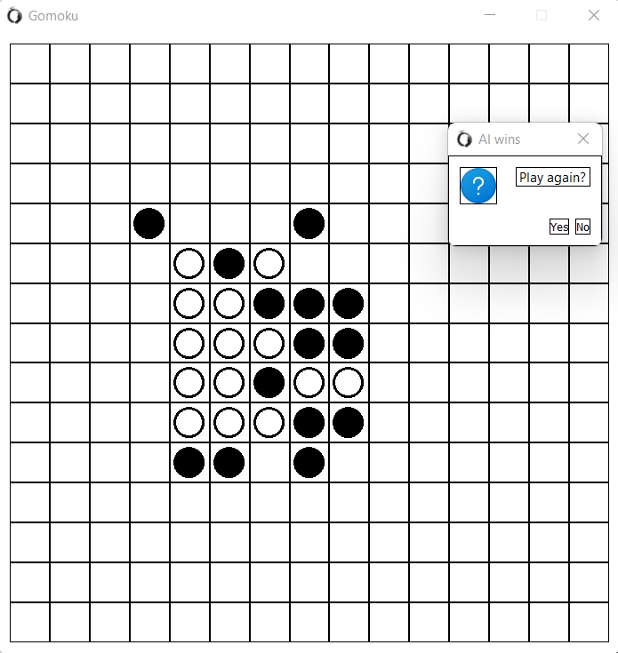

# gomoku-pyqt
Toy project -- implementing Gomoku with minimax and alpha/beta.
GUI implemented via PyQT5.

Game engine is separated from GUI, can be used in Jupyter if no PyQT is available.
This engine is not perfect (although it is known that first-move has winning strategy, see, for example, https://github.com/fucusy/gomoku-first-move-always-win), moreover player moves first - so try your best to win. Engine is forecasting three future moves.

Basically this is a study project to learn a bit of PyQT and get experience with simple minimax AI.

To run with GUI enter in cmd: python main.py